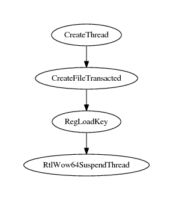

# Malware variants identification by graph similarity

## Introduction

This repository supplies additional material for the *Malware Similarity* paper.

### Goals

This work is aimed to:

* Study malware similarity techniques and their limitations.
* Provide some insights on how we could overcome some challenges.

### Authors

This work was developed by Marcus Botacin, under supervision of Prof. Dr. Paulo Lício de Geus and Prof. Dr. André Ricardo Abed Grégio.

## Data Extraction

The functions here mentioned were obtained from dynamic, transparent traces obtained using our [BranchMonitor](https://github.com/marcusbotacin/BranchMonitoringProject) solution.

## Similarity Issues

We tackled the similarity matching problem from two perspectives: i) The used features, and ii) The used matching metrics.

### Features

In particular, we are interested on approaches which make use of function as feature, as shown below:

```
LdrGetProcedureAddress -> LdrLoadDll
LdrGetDllHandle -> LdrLoadDll
NtOpenMutant -> ZwMapViewOfSection
NtCreateMutant -> ZwMapViewOfSection
```

#### Fail cases

This kind of approach presents a drawback: Same-behavior function replacement, as shown on the figures below:

Function-Based 1    |   Function-Based 2
:------------------:|:------------------:
     | 

Despite having the same behavior, these samples would have been classified as non-similar by a function-based approach.

#### Our Proposed Approach

### Metrics

#### Fail cases

## Repository Organization

The repository is organized as follows:

* *Classes* : Behavior classes associated to DLL functions.

## Examples

## Cluster results

## Publication

Thio work was published at: TBD
