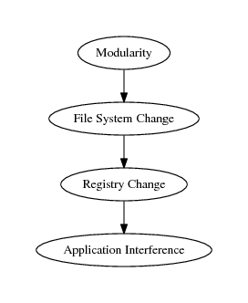
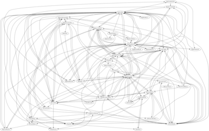
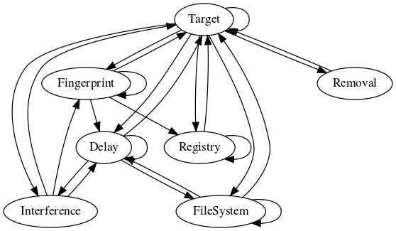
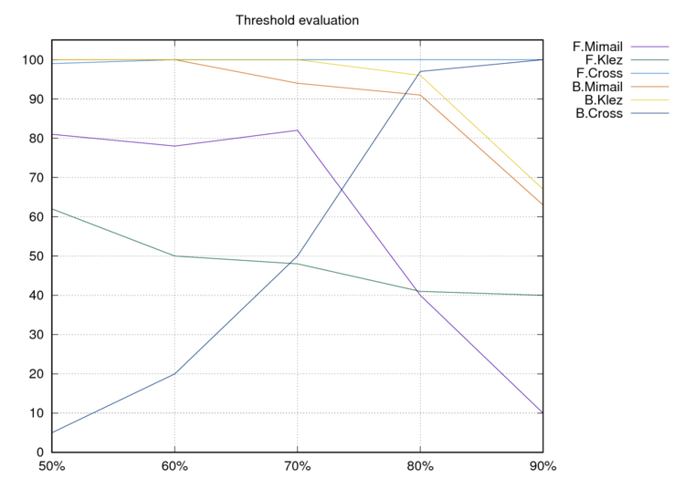

# Malware variants in practice: An approach using graph similarity.

## Introduction

This repository supplies additional material for the *Malware Similarity* paper.

### Goals

This work is aimed to:

* Study malware similarity techniques and their limitations.
* Provide some insights on how we could overcome some challenges.

### Authors

This work was developed by Marcus Botacin, under supervision of Prof. Dr. Paulo Lício de Geus and Prof. Dr. André Ricardo Abed Grégio.

## Data Extraction

The functions here mentioned were obtained from dynamic, transparent traces obtained using our [BranchMonitor](https://github.com/marcusbotacin/BranchMonitoringProject) solution.

## Similarity Issues

We tackled the similarity matching problem from two perspectives: i) The used features, and ii) The used matching metrics.

### Features

In particular, we are interested on approaches which make use of function as feature, as shown below:

```
LdrGetProcedureAddress -> LdrLoadDll
LdrGetDllHandle -> LdrLoadDll
NtOpenMutant -> ZwMapViewOfSection
NtCreateMutant -> ZwMapViewOfSection
```

#### Fail cases

This kind of approach presents a drawback: Same-behavior function replacement, as shown on the figures below:

Function-Based 1    |   Function-Based 2
:------------------:|:------------------:
     | 

Despite having the same behavior, these samples would have been classified as non-similar by a function-based approach.

#### Our Proposed Approach

As a solution for this case, we have adopted a behavior-based approach. This way, the above samples would be considered as similar, as shown below:

Function-Based 1    |   Function-Based 2    | Our Approach
:------------------:|:---------------------:|:-----------------:
     |        |   

### Similarity Metrics

The usual metric for similarity measurement is the following:


In this metric, the score will be minimum (0.0) when the inputs are totally distinct, and maximum (1.0) when the inputs are exactly the same.

#### Fail cases

Using this metrics also presents a drawback: When a sample is embbed inside another, as in the example shown below:

Original Sample         |   Embedded Sample
:----------------------:|:------------------:
  | 

In this example, the similarity score is 50%, despite the fact the sample 1 is completely embedded on sample 2. This way, we need to find a similarity metric which could provide more information about the similarity quality.

#### Our proposal: Using another metric

This way, our proposal is to adopt the following metric:


In this metric, the similarity will be maximum not only when the two samples are equal but also when one is inside another, as desired.

## Repository Organization

The repository is organized as follows:

* *Classes* : Behavior classes associated to DLL functions.
* *Examples*: Graphs examplifying the aforementioned approaches.
    * *Behaviors*: Behavior-based graphs.
    * *Functions*: Function-based graphs.
* *Code*: Python scripts to handle graphs and trace data.
    * *Function.to.behavior*: Given a function, return its behavior class.
    * *Generate.graph*: Given an edge list, draw the graph.
* *Data*: Data used on our experiments, so you can reproduce it.
    * *Functions*: Function traces for selected samples.
    * *Results*: Graph similarity results for selected samples.

## Examples

The graphs below exemplify the differences between the original approach and our one.

Function-Based                                          |   Behavior-Based
:------------------------------------------------------:|:----------------------------------------------------:
   | 

## Cluster results

An important task empowered by our approach is sample clustering. The figures below show the clustering scores for the following datasets: *Mimail*, *Klez*, and a mix of them.



We can notice small thresholds are not able to properly cluster the *mix* dataset, which is achieved for thresholds higher than 80%. In addition, these thresholds are also able to provide a good clustering result for the *same-family* datasets.

## Publication

Thio work was published at: **To Be Published**
